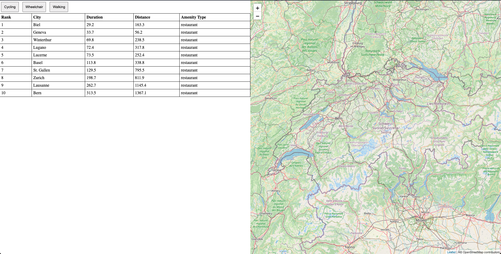

Steps to run this script:

1. install npm and node
2. run `npm i` to install dependencies
3. get an API key from: https://openrouteservice.org/dev/#/home and export OPEN_ROUTE_SERVICE_API_KEY env variable
4. run the script with: `OPEN_ROUTE_SERVICE_API_KEY=api_key node index.js`
5. the script will output `cityData.json` once it's done
6. for simplicity's sake, copy the content of `cityData.json` into the `index.html` file
7. you can run a local server to serve the website if you have python by running: `python -m http.server` then go to `localhost:8000` to see the website

